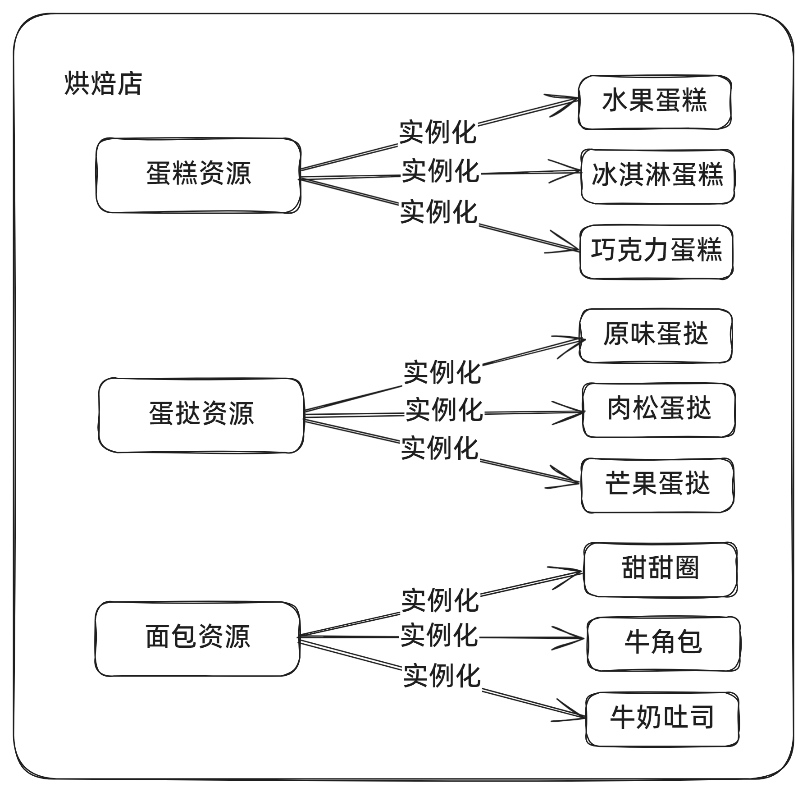
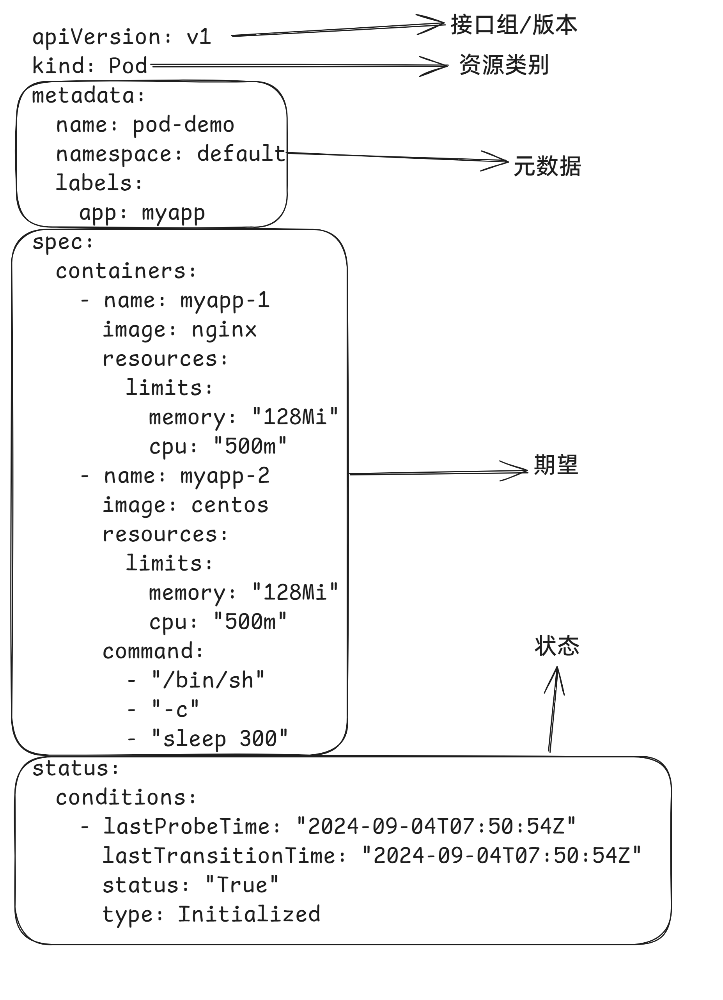
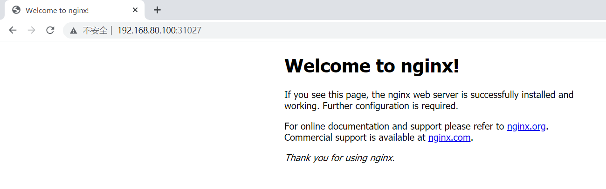
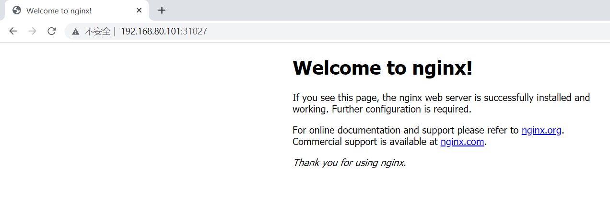
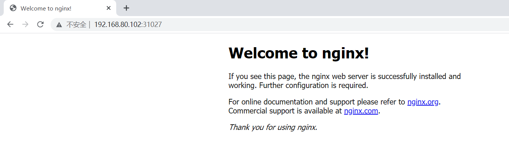

# 04.资源清单


- [资源](read://https_cloud.eagleslab.com/?url=https%3A%2F%2Fcloud.eagleslab.com%2FLinux%2F04.%E4%BA%91%E8%AE%A1%E7%AE%97%2F03.kubernetes%2F04.%E8%B5%84%E6%BA%90%E6%B8%85%E5%8D%95.html#资源)

- - [资源类别](read://https_cloud.eagleslab.com/?url=https%3A%2F%2Fcloud.eagleslab.com%2FLinux%2F04.%E4%BA%91%E8%AE%A1%E7%AE%97%2F03.kubernetes%2F04.%E8%B5%84%E6%BA%90%E6%B8%85%E5%8D%95.html#资源类别)

- [资源清单编写](read://https_cloud.eagleslab.com/?url=https%3A%2F%2Fcloud.eagleslab.com%2FLinux%2F04.%E4%BA%91%E8%AE%A1%E7%AE%97%2F03.kubernetes%2F04.%E8%B5%84%E6%BA%90%E6%B8%85%E5%8D%95.html#资源清单编写)

- [快速体验](read://https_cloud.eagleslab.com/?url=https%3A%2F%2Fcloud.eagleslab.com%2FLinux%2F04.%E4%BA%91%E8%AE%A1%E7%AE%97%2F03.kubernetes%2F04.%E8%B5%84%E6%BA%90%E6%B8%85%E5%8D%95.html#快速体验)


# 资源

kubernetes系统的 api server基于http/https接收并响应客户端的操作请求，它提供了一种基于资源的RESTful风格的编程结构，将集群的各种组件都抽象成为标准的REST资源，如Node、Namespace和Pod等，并支持通过标准的HTTP方法以JSON为数据序列化方案进行资源管理操作。

kubernetes系统将一切事物都抽象为API资源。资源实例化之后，叫做对象。



## 资源类别

- 名称空间级别
  - 工作负载型资源：Pod、ReplicaSet、Deployment...
  - 服务发现及负载均衡型资源:Service、Ingress...
  - 配置与存储型资源：Volume、CSI...
  - 特殊类型的存储卷：ConfigMap、Secre...
- 集群级资源(与集群相关的资源)
  - Namespace、Node、ClusterRole、ClusterRoleBinding
- 元数据型资源(为集群内部的其他资源配置其行为或特性)
  - HPA、PodTemplate、LimitRange

# 资源清单编写

```yaml
apiVersion: v1
kind: Pod
metadata:
  name: pod-demo
  namespace: default
  labels:
    app: myapp
spec:
  containers:
    - name: myapp-1
      image: nginx
      resources:
        limits:
          memory: "128Mi"
          cpu: "500m"
    - name: myapp-2
      image: centos:7
      resources:
        limits:
          memory: "128Mi"
          cpu: "500m"
      command:
        - "/bin/sh"
        - "-c"
        - "sleep 300"
status:
  conditions:
    - lastProbeTime: "2024-09-04T07:50:54Z"
      lastTransitionTime: "2024-09-04T07:50:54Z"
      status: "True"
      type: Initialized

[root@localhost ~]# mkdir pods
[root@localhost ~]# cd pods/
[root@localhost pods]# vim test.yaml
[root@localhost pods]# kubectl create -f test.yaml
pod/pod-demo created
[root@localhost pods]# kubectl get pod
NAME       READY   STATUS              RESTARTS   AGE
pod-demo   0/2     ContainerCreating   0          15s

# 查看pod的状态
[root@localhost pods]# kubectl describe pods pod-demo
Name:                      pod-demo
Namespace:                 default
Priority:                  0
Service Account:           default
Node:                      k8s-node02/192.168.88.30
Start Time:                Sun, 30 Mar 2025 22:53:01 +0800
Labels:                    app=myapp
Annotations:               cni.projectcalico.org/containerID: ab12e5f15578131fa38286c99c6984153c54e166c15ed98b9a23f34518b9e77e
                           cni.projectcalico.org/podIP: 10.244.58.194/32
                           cni.projectcalico.org/podIPs: 10.244.58.194/32
Status:                    Terminating (lasts 0s)
Termination Grace Period:  30s
IP:                        10.244.58.194
IPs:
  IP:  10.244.58.194
Containers:
  myapp-1:
    Container ID:   docker://8d380b77c3ca7eaa64db3a017e778f28f05851a6032f6b81bfb422ebbdb2ae03
    Image:          nginx
    Image ID:       docker-pullable://nginx@sha256:124b44bfc9ccd1f3cedf4b592d4d1e8bddb78b51ec2ed5056c52d3692baebc19
    Port:           <none>
    Host Port:      <none>
    State:          Running
      Started:      Sun, 30 Mar 2025 22:53:04 +0800
    Ready:          True
    Restart Count:  0
    Limits:
      cpu:     500m
      memory:  128Mi
    Requests:
      cpu:        500m
      memory:     128Mi
    Environment:  <none>
    Mounts:
      /var/run/secrets/kubernetes.io/serviceaccount from kube-api-access-whlhn (ro)
  myapp-2:
    Container ID:  docker://0f50eb125694b8921e6cb464154fd77f13c8de64a48a1e09974e5833642fd3c9
    Image:         centos:7
    Image ID:      docker-pullable://centos@sha256:be65f488b7764ad3638f236b7b515b3678369a5124c47b8d32916d6487418ea4
    Port:          <none>
    Host Port:     <none>
    Command:
      /bin/sh
      -c
      sleep 300
    State:          Running
      Started:      Sun, 30 Mar 2025 22:53:04 +0800
    Ready:          True
    Restart Count:  0
    Limits:
      cpu:     500m
      memory:  128Mi
    Requests:
      cpu:        500m
      memory:     128Mi
    Environment:  <none>
    Mounts:
      /var/run/secrets/kubernetes.io/serviceaccount from kube-api-access-whlhn (ro)
Conditions:
  Type                        Status
  PodReadyToStartContainers   True
  Initialized                 True
  Ready                       True
  ContainersReady             True
  PodScheduled                True
Volumes:
  kube-api-access-whlhn:
    Type:                    Projected (a volume that contains injected data from multiple sources)
    TokenExpirationSeconds:  3607
    ConfigMapName:           kube-root-ca.crt
    ConfigMapOptional:       <nil>
    DownwardAPI:             true
QoS Class:                   Guaranteed
Node-Selectors:              <none>
Tolerations:                 node.kubernetes.io/not-ready:NoExecute op=Exists for 300s
                             node.kubernetes.io/unreachable:NoExecute op=Exists for 300s
Events:
  Type    Reason     Age   From               Message
  ----    ------     ----  ----               -------
  Normal  Scheduled  39s   default-scheduler  Successfully assigned default/pod-demo to k8s-node02
  Normal  Pulling    39s   kubelet            Pulling image "nginx"
  Normal  Pulled     36s   kubelet            Successfully pulled image "nginx" in 2.479s (2.479s including waiting)
  Normal  Created    36s   kubelet            Created container myapp-1
  Normal  Started    36s   kubelet            Started container myapp-1
  Normal  Pulled     36s   kubelet            Container image "centos:7" already present on machine
  Normal  Created    36s   kubelet            Created container myapp-2
  Normal  Started    36s   kubelet            Started container myapp-2
  Normal  Killing    29s   kubelet            Stopping container myapp-1
  Normal  Killing    29s   kubelet            Stopping container myapp-2
```

每个组成部分如下



查询对象属性

```bash
$ kubectl explain pod.spec.containers
KIND:       Pod
VERSION:    v1

FIELD: containers <[]Container>

DESCRIPTION:
    List of containers belonging to the pod. Containers cannot currently be
    added or removed. There must be at least one container in a Pod. Cannot be
    updated.
    A single application container that you want to run within a pod.
...
```

kubectl的部分命令

```bash
# 获取当前的资源，pod
$ kubectl get pod 
    -A,--all-namespaces 查看当前所有名称空间的资源
    -n  指定名称空间，默认值 default，kube-system 空间存放是当前组件资源
    --show-labels  查看当前的标签
    -l  筛选资源，key、key=value
    -o wide  详细信息包括 IP、    分配的节点
    -w  监视，打印当前的资源对象的变化部分

# 进入 Pod 内部的容器执行命令
$ kubectl exec -it podName -c cName -- command
    -c  可以省略，默认进入唯一的容器内部

# 查看资源的描述
$ kubectl explain pod.spec

# 查看 pod 内部容器的 日志
$ kubectl logs podName -c cName

# 查看资源对象的详细描述
$ kubectl describe pod podName

# 删除资源对象
$ kubectl delete kindName objName
    --all 删除当前所有的资源对象
```

# 快速体验

弹性伸缩，故障自愈，自动负载

- 创建nginx容器

```bash
[root@k8s-master1 ~]#  kubectl create deployment nginx --image=nginx
deployment.apps/nginx created
```

- 暴露对外端口

```bash
[root@k8s-master1 ~]#  kubectl expose deployment nginx --port=80 --type=NodePort
service/nginx exposed
```

- 查看nginx是否运行成功

```bash
[root@k8s-master1 ~]#  kubectl get pod,svc
NAME                         READY   STATUS    RESTARTS   AGE
pod/nginx-6799fc88d8-qthk8   1/1     Running   0          71s

NAME                 TYPE        CLUSTER-IP      EXTERNAL-IP   PORT(S)        AGE
service/kubernetes   ClusterIP   172.16.0.1      <none>        443/TCP        34m
service/nginx        NodePort    172.16.170.23   <none>        80:31027/TCP   30s
```








- 扩容

```bash
[root@k8s-master1 ~]# kubectl get pods
NAME                     READY   STATUS    RESTARTS   AGE
nginx-6799fc88d8-qthk8   1/1     Running   0          8m5s
[root@k8s-master1 ~]# kubectl scale deployment nginx --replicas=3
deployment.apps/nginx scaled
[root@k8s-master1 ~]# kubectl get pods
[root@k8s-master1 ~]# kubectl get pods
NAME                     READY   STATUS    RESTARTS   AGE
nginx-6799fc88d8-46gmb   1/1     Running   0          64s
nginx-6799fc88d8-kn2dq   1/1     Running   0          64s
nginx-6799fc88d8-qthk8   1/1     Running   0          9m11s

# 缩容
[root@localhost pods]# kubectl scale deployment nginx --replicas=1
deployment.apps/nginx scaled
[root@localhost pods]# kubectl get pod
NAME                     READY   STATUS    RESTARTS   AGE
nginx-7854ff8877-xnxzl   1/1     Running   0          4m17s

# 故障自愈
[root@localhost pods]# kubectl delete pod/nginx-7854ff8877-hr257

# 观察发现，自动拉起新的pod，维护pod副本的数量
```

学前沿IT，到英格科技!本文发布时间： 2025-03-30 23:07:56